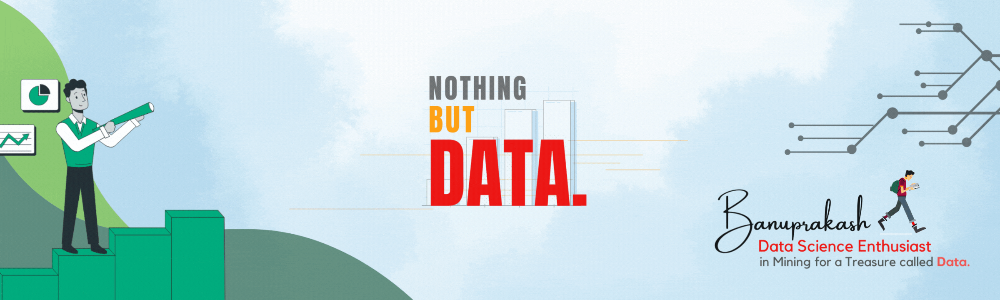

<h1 align="center">Hi 👋🏻 Techies, I'm Banuprakash Vellingiri 😊 </h1>
<h3 align="center">A Passionate 📊 Data Science and 💻 Machine Learning Aspirant from Tamil Nadu,India.📍</h3>

<h3 align="left">⌛On Progress:</h3>

- 👨🏻‍💻 I’m currently learning Natural Language Processing (NLP) and Deep Learning

<h3 align="left">⚙️Languages and Tools:</h3>

- Python (Pandas,NumPy,Matplotlib,Seaborn)
- MYSQL
- Machine Learning (Scikit-Learn)
- Deep learning (Tensor flow)
- Natural Language Processing (NLP)
- Excel
- Power BI
- Web Scraping (Selenium)

       

<h3 align="left">🤝🏻Connect with me:</h3>

- 📧Email   : [banuprakashmec@gmail.com](banuprakashmec@gmail.com)
- 🔗Linkedin : [Banuprakash Vellingiri](https://www.linkedin.com/in/banuprakashvellingiri)
- kaggle : [Banuprakash V](https://www.kaggle.com/banuprakashv)

<!---
Banuprakash-Vellingiri/Banuprakash-Vellingiri is a ✨ special ✨ repository because its `README.md` (this file) appears on your GitHub profile.
You can click the Preview link to take a look at your changes.
--->
